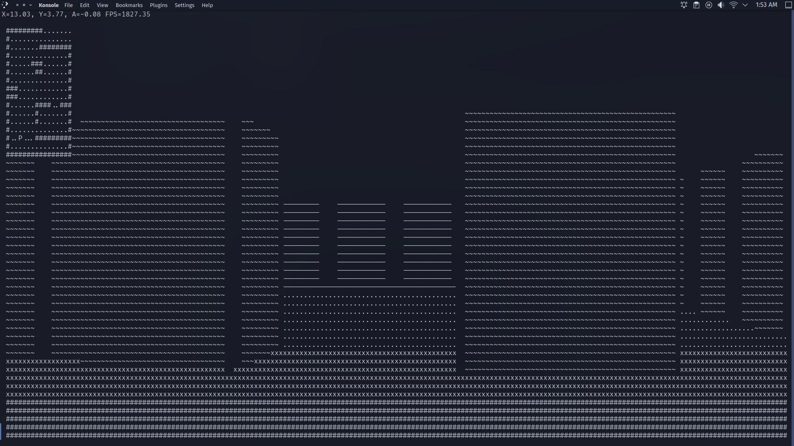

# 3D_RayCasting_Game
This project is a text-based 3D raycasting game that utilizes the ncurses library and ASCII characters to create a virtual environment within a terminal window. The game employs raycasting techniques to simulate 3D depth and perspective, and features responsive controls, collision detection, and dynamic rendering. 
## To Run
```
g++ -o exec RayCast.cc -lncurses && ./exec
```
## Instructions
- w, s for forward and backward movement
- a, d for left and right turning
- q to quit

## Preview

